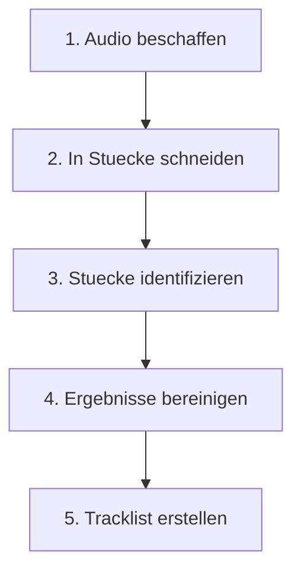
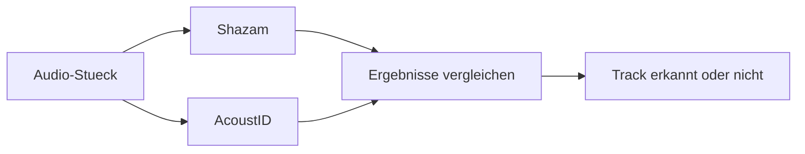
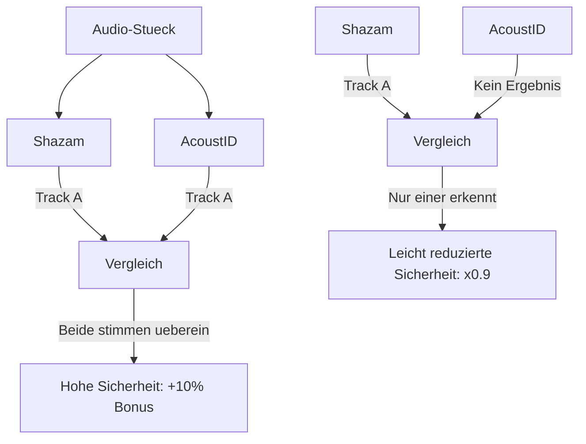
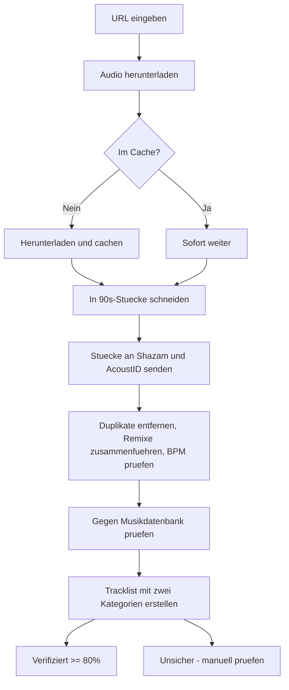

# Wie funktioniert Tracklistify?

Eine Erklaerung fuer alle, die wissen moechten, was hinter der automatischen Tracklist-Erkennung steckt — ganz ohne Programmierkenntnisse.

---

## Was macht Tracklistify?

Stell dir vor, du hoerst einen zweistuendigen DJ-Mix und fragst dich: *"Welche Tracks wurden hier gespielt?"*

Du koenntest dein Handy nehmen und Shazam oeffnen — aber das funktioniert nur fuer den einen Track, der gerade laeuft. Bei einem zweistuendigen Mix mit 30+ Tracks muessstest du alle paar Minuten Shazam oeffnen und hoffen, dass es gerade keinen Uebergang zwischen zwei Tracks gibt.

**Tracklistify macht genau das — automatisch und fuer den gesamten Mix auf einmal.**

Du gibst eine URL ein (z.B. von SoundCloud) und bekommst eine fertige Tracklist zurueck:

```
Eingabe:  https://soundcloud.com/township-rebellion/fusion-festival-2022
Ausgabe:  Eine Liste aller erkannten Tracks mit Zeitstempel und Sicherheit
```

---

## Der Ablauf in 5 Schritten



### Schritt 1: Audio beschaffen

Tracklistify nimmt eine URL (SoundCloud, YouTube, Mixcloud) und laedt die Audiodatei herunter. Das ist wie "Rechtsklick > Speichern unter", nur automatisiert.

Wenn du denselben Mix nochmal analysierst, wird die Datei aus einem lokalen Zwischenspeicher (Cache) geladen — das spart Zeit und Bandbreite.

### Schritt 2: In Stuecke schneiden

Ein zweistuendiger Mix ist zu lang, um ihn als Ganzes zu erkennen. Deshalb wird er in viele kleine Stuecke (Segmente) zerschnitten — wie ein Kuchen, der in gleich grosse Stuecke geteilt wird.

```
|---- Mix (2 Stunden) --------------------------------------------|
|Stueck 1|Stueck 2|Stueck 3|Stueck 4|  ...  |Stueck N|
|  90s   |  90s   |  90s   |  90s   |       |  90s   |
```

Jedes Stueck ist etwa 90 Sekunden lang. Die Stuecke ueberlappen sich leicht, damit kein Track "zwischen zwei Stuecken" verloren geht — wie wenn man beim Kuchenteilen ein kleines Stueck doppelt abdeckt.

### Schritt 3: Stuecke identifizieren

Jedes dieser 90-Sekunden-Stuecke wird an einen oder mehrere Musikerkennungsdienste geschickt:

- **Shazam** — der bekannteste Dienst, erkennt Tracks anhand ihrer einzigartigen Klangmuster
- **AcoustID** — ein Open-Source-Dienst, der einen anderen Erkennungsansatz nutzt

Das ist wie wenn du einen Song im Radio hoerst und zwei verschiedene Freunde fragst: *"Kennst du diesen Track?"* — je mehr Freunde ihn erkennen, desto sicherer bist du, dass die Antwort stimmt.



### Schritt 4: Ergebnisse bereinigen

Die Rohergebnisse sind noch nicht perfekt. Deshalb werden sie in mehreren Schritten bereinigt:

**Duplikate entfernen:** Wenn derselbe Track in drei aufeinanderfolgenden Stuecken erkannt wird (weil er laenger als 90 Sekunden gespielt wurde), behaelt Tracklistify nur einen Eintrag — den mit der hoechsten Sicherheit.

**Remixe zusammenfuehren:** Wenn ein Stueck "Track X" erkennt und das naechste "Track X (Remix)", werden diese als ein Track behandelt. Der DJ hat hoechstwahrscheinlich den Remix gespielt, nicht Original und Remix nacheinander.

**Zu kurze Treffer filtern:** Wenn ein Track angeblich nur 30 Sekunden gespielt wurde, ist das verdaechtig — DJs spielen Tracks normalerweise mindestens eine Minute. Solche Kurzeintraege werden entfernt, da sie oft Fehlerkennungen sind.

**Sicherheitsschwelle anwenden:** Tracks mit zu niedriger Sicherheit (unter 65%) werden verworfen.

### Schritt 5: Tracklist erstellen

Die bereinigten Ergebnisse werden als Tracklist gespeichert. Dabei werden die Tracks in zwei Kategorien eingeteilt:

**Verifiziert (Sicherheit >= 80%):**
> 1. **00:05:18** - Township Rebellion - Moses
> 2. **00:12:17** - Enrico Sangiuliano - Future Dust

**Unsicher (Sicherheit < 80%) — manuell pruefen:**
> 1. **00:09:38** - Veerus - Phase *(Confidence: 72%)*

Am Ende steht eine Statistik mit Gesamtzahl, durchschnittlicher Sicherheit und BPM-Informationen.

---

## Wie funktioniert Musikerkennung?

### Audio-Fingerprinting

Jeder Mensch hat einen einzigartigen Fingerabdruck. Aehnlich hat jeder Song einen einzigartigen "Audio-Fingerabdruck" — ein Muster aus Frequenzen und Rhythmen, das ihn von allen anderen Songs unterscheidet.

```
Song "Moses"           Audio-Fingerabdruck
+-----------------+    +-----------------------+
| Melodie         | -> | Frequenzmuster A-B-C  |
| Rhythmus        | -> | Rhythmusmuster X-Y-Z  |
| Klangfarbe      | -> | Klangprofil 42-17-89  |
+-----------------+    +-----------------------+
```

Wenn Tracklistify ein 90-Sekunden-Stueck an Shazam schickt, berechnet Shazam den Fingerabdruck dieses Stuecks und vergleicht ihn mit einer riesigen Datenbank von Millionen bekannter Songs. Wenn es eine Uebereinstimmung gibt, kommt die Antwort: *"Das ist Moses von Township Rebellion, Sicherheit 90%."*

### Warum liegt die Erkennung manchmal falsch?

- **Remixe und Edits:** Ein Remix teilt sich Teile des Originals. Shazam erkennt vielleicht das Original, obwohl der Remix gespielt wurde.
- **Samples:** Wenn Track A ein beruemhtes Sample aus Track B verwendet, kann Shazam faelschlicherweise Track B erkennen.
- **Starke Uebergaenge:** Wenn der DJ zwei Tracks uebereinanderlegt (Uebergang/Transition), hoert Shazam eine Mischung aus beiden und kann keinen eindeutig zuordnen.
- **Unveroeffentlichte Tracks:** Eigene Edits oder Bootlegs der DJs existieren nicht in Shazams Datenbank.

---

## Was bedeutet "Confidence" (Sicherheit)?

Die Sicherheit ist eine Prozentzahl, die angibt, wie sicher sich der Erkennungsdienst ist:

| Sicherheit | Bedeutung | Beispiel |
|---|---|---|
| 90-100% | Sehr sicher | Track laeuft solo, klare Erkennung |
| 80-89% | Sicher | Track laeuft, leichter Uebergang |
| 65-79% | Unsicher | Uebergang, oder aehnlicher Track |
| Unter 65% | Zu unsicher | Wird verworfen |

**Warum 80% als Schwelle fuer "verifiziert"?**

Durch Tests mit echten DJ-Mixes hat sich gezeigt, dass Tracks mit ueber 80% Sicherheit fast immer korrekt erkannt werden. Unter 80% steigt die Fehlerquote deutlich — deshalb werden diese Tracks separat als "unsicher" markiert.

---

## Multi-Provider: Warum mehrere Dienste?

Stell dir vor, du gehst zum Arzt und bekommst eine Diagnose. Wenn du unsicher bist, holst du dir eine zweite Meinung bei einem anderen Arzt. Wenn beide zum gleichen Ergebnis kommen, bist du viel sicherer.

Genauso funktioniert Multi-Provider bei Tracklistify:



- **Beide Dienste erkennen denselben Track:** Sehr hohe Sicherheit (Durchschnitt + 10% Bonus)
- **Nur ein Dienst erkennt etwas:** Leicht reduzierte Sicherheit (x 0.9), da keine Bestaetigung vorliegt
- **Beide erkennen unterschiedliche Tracks:** Der mit hoeherer Sicherheit wird behalten, aber abgewertet

---

## BPM-Analyse: Der Plausibilitaetscheck

BPM steht fuer "Beats Per Minute" — wie schnell die Musik ist. In einem typischen Techno-Set liegen die meisten Tracks zwischen 125 und 135 BPM.

Tracklistify analysiert den BPM-Wert jedes Segments und prueft, ob er zum Rest des Sets passt. Wenn ploetzlich ein Track mit 80 BPM in einem 130-BPM-Set auftaucht, ist das verdaechtig — wahrscheinlich eine Fehlerkennnung.

```
Set-BPM:    128  130  127  129  80?  131  128
                                ^^
                          Ausreisser! Wahrscheinlich falsch erkannt.
```

Solche Ausreisser werden markiert und ihre Sicherheit wird reduziert.

---

## Datenbank-Verifizierung

Als zusaetzliche Kontrolle prueft Tracklistify, ob ein erkannter Track tatsaechlich in der MusicBrainz-Datenbank existiert — einer grossen, offenen Musikdatenbank mit Millionen von Eintraegen.

Wenn Shazam behauptet, "Track XYZ von Kuenstler ABC" erkannt zu haben, aber weder Track noch Kuenstler in MusicBrainz existieren, ist das ein Warnsignal.

---

## Bekannte Einschraenkungen

Tracklistify ist ein Werkzeug, kein perfektes Orakel. Es gibt Grenzen:

**Was gut erkannt wird:**
- Veroeffentlichte Tracks auf bekannten Labels
- Tracks die solo (ohne Uebergang) gespielt werden
- Populaere Tracks mit vielen Streams

**Was schlecht oder gar nicht erkannt wird:**
- DJ-eigene Edits und Bootlegs (nicht in Datenbanken)
- Stark gemischte Uebergaenge (zwei Tracks gleichzeitig)
- Sehr unterirdische/obskure Veroeffentlichungen
- Tracks die nur kurz angespielt werden (unter 60 Sekunden)

**Typische Fehlerquoten:**
- Von 37 tatsaechlich gespielten Tracks werden ca. 20-28 korrekt erkannt
- Dazu kommen ca. 5-15 falsche Treffer (Falsch-Positive)
- Die Tracklist sollte daher immer manuell gegengeprueft werden

---

## Zusammenfassung



**Tracklistify ist wie ein fleissiger Assistent, der den gesamten Mix Stueck fuer Stueck durchhoert, jeden Abschnitt an mehrere Experten schickt, die Antworten vergleicht, offensichtliche Fehler aussortiert und dir am Ende eine aufgeraeumte Liste praesentiert — sortiert nach Sicherheit.**
